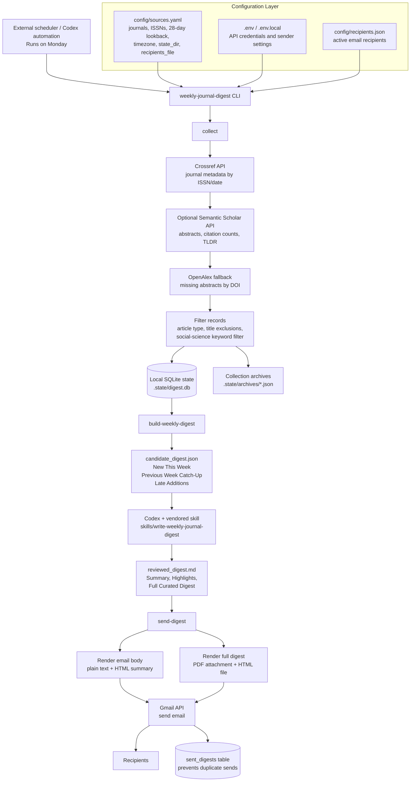

# Weekly Journal Digest

`weekly-journal-digest` is a Python CLI for collecting recently published journal articles, preserving local state, preparing a review handoff, and sending a curated weekly digest through the Gmail API.

The project intentionally does not implement scheduling. Run it from an external scheduler, such as cron, GitHub Actions, or a Codex automation.

## What It Does

- Collects journal metadata from Crossref for configured journals and date windows.
- Enriches missing abstracts with OpenAlex by DOI.
- Optionally enriches records with Semantic Scholar abstracts, citation counts, and TLDR summaries.
- Stores local SQLite state so repeated runs do not duplicate articles.
- Builds a deterministic `candidate_digest.json` for review.
- Renders reviewed markdown into plain text, HTML, and PDF outputs.
- Sends the final digest through Gmail and records successful sends to prevent accidental duplicates.

## Architecture



## API And Credential Requirements

The collection pipeline can run without paid or required metadata API keys.

- Crossref: no API key is required. Set `WJD_CROSSREF_MAILTO` to a contact email so requests identify the operator.
- OpenAlex: no API key is required. The repo uses OpenAlex as a fallback for missing abstracts by DOI.
- Semantic Scholar: optional. Set `WJD_SEMANTIC_SCHOLAR_API_KEY` to improve abstract coverage and add citation/TLDR metadata.
- Gmail: required only for `send-digest`. Gmail uses OAuth client credentials and a local token file, not a simple API key.

Environment variables are loaded from `.env.local` and `.env` when present. These files are ignored by git and should not be committed.

Example `.env.local`:

```bash
WJD_CROSSREF_MAILTO=you@example.edu
WJD_SEMANTIC_SCHOLAR_API_KEY=optional_key_here

WJD_GMAIL_CREDENTIALS_FILE=/absolute/path/to/google-oauth-client.json
WJD_GMAIL_TOKEN_FILE=/absolute/path/to/gmail-token.json
WJD_GMAIL_SENDER=you@example.edu
WJD_GMAIL_FROM_NAME=COMAP Journal Bot
```

`WJD_GMAIL_FROM_NAME` is optional and defaults to `COMAP Journal Bot`.

## Journal List

Communication journals:

- Journal of Communication
- Journal of Computer-Mediated Communication
- Political Communication
- Human Communication Research
- Communication Research
- Communication Methods and Measures

Political science journals:

- American Journal of Political Science
- American Political Science Review
- Political Analysis

General science journals with social-science filtering:

- Nature
- Science
- PNAS
- Science Advances
- Nature Human Behaviour
- Nature Communications
- Nature Machine Intelligence
- Nature Computational Science

For the general-science group, the collector keeps only social-science-related research articles or brief reports using deterministic keyword and metadata rules.

## Weekly Windows

The Monday digest uses a rolling 28-day collection window to avoid misses from delayed indexing or transient publisher issues.

- `New This Week`: articles published during the previous 7 complete days.
- `Previous Week Catch-Up`: articles published during the 7 days before that.
- `Late Additions`: older articles first discovered during the current digest cycle.

This means the Monday run is not limited to the previous 7 days. It looks back 28 days, deduplicates against local state, and classifies output into the weekly sections above.

For example, for the week `2026-03-15` through `2026-03-21`, use `--digest-date 2026-03-22`.

## Local State

- Local SQLite state lives under `.state/` by default.
- Collection archives are written to `.state/archives/` for debugging and auditability.
- Recipient configuration lives in local-only `config/recipients.json` by default.
- Collection is idempotent. Re-running `collect` or `build-weekly-digest` should not duplicate articles.
- Sending is idempotent per digest date and recipient unless `--force` is used.
- Collection automatically retries transient DNS and transport failures before marking a source as failed.

## Workflow

The operational flow is:

1. Determine the Monday digest date and the exact weekly window.
2. Run `collect` to fetch journal metadata for a rolling window and upsert it into local SQLite state.
3. Run `build-weekly-digest` with the Monday digest date to generate a deterministic `candidate_digest.json`.
4. Review `candidate_digest.json`, keep all communication and political science journal articles, filter and rank the general-science candidates for research-group relevance, and write a structured `reviewed_digest.md`.
5. Run `render-digest --full-html` to generate no-send preview artifacts: plain text, full HTML, and PDF.
6. Inspect the `.preview.html` and `.preview.pdf` files before delivery.
7. Run `send-digest --full-html` to send the HTML digest body and attach the full curated PDF plus the sibling full HTML file.

The reviewed markdown should contain these major sections:

1. `Summary`
2. optional `Collection Snapshot`
3. `Highlights`
4. `Full Curated Digest`

For every kept article in the full curated digest, include abstract, authors, affiliations when available, DOI, and link.

## Recipients

The default recipient list is stored in local-only `config/recipients.json`. This file is intentionally ignored by git because it contains real delivery addresses. Start from `config/recipients.example.json` when setting up a new checkout.

Example:

```json
{
  "recipients": [
    {
      "email": "recipient@example.edu",
      "name": "Recipient",
      "active": true
    }
  ]
}
```

`send-digest` sends to every active address in that file unless `--recipient` is provided. You can also provide a comma-separated `WJD_GMAIL_RECIPIENT` environment variable for local overrides.

## CLI

Install the repo in editable mode:

```bash
python3 -m pip install -e .
```

Collect or refresh the rolling source window:

```bash
weekly-journal-digest collect
```

Build a deterministic weekly review artifact:

```bash
weekly-journal-digest build-weekly-digest \
  --digest-date 2026-03-30 \
  --output out/candidate_digest-2026-03-30.json
```

Render no-send previews:

```bash
weekly-journal-digest render-digest \
  --reviewed-digest out/reviewed_digest-2026-03-30.md \
  --recipient-name "Recipient Name" \
  --full-html
```

This writes sibling preview files using the reviewed digest stem:

- `reviewed_digest-2026-03-30.preview.txt`
- `reviewed_digest-2026-03-30.preview.html`
- `reviewed_digest-2026-03-30.preview.pdf`

Send the reviewed digest:

```bash
weekly-journal-digest send-digest \
  --digest-date 2026-03-30 \
  --reviewed-digest out/reviewed_digest-2026-03-30.md \
  --full-html
```

Optional one-off recipient override:

```bash
weekly-journal-digest send-digest \
  --digest-date 2026-03-30 \
  --reviewed-digest out/reviewed_digest-2026-03-30.md \
  --recipient someone@example.com
```

If the reviewed markdown starts with `Subject: ...`, that subject line is used automatically.

Use `--full-html` when the HTML preview or outgoing email should include the collection snapshot and full curated digest directly in the message body. Without it, the HTML body stays compact and contains only the summary and highlights.

## Example Weekly Run

```bash
python3 -m pip install -e .

weekly-journal-digest collect \
  --lookback-days 28 \
  --end-date 2026-03-22

weekly-journal-digest build-weekly-digest \
  --digest-date 2026-03-22 \
  --output out/candidate_digest-2026-03-22.json

# Review out/candidate_digest-2026-03-22.json and write:
# out/reviewed_digest-2026-03-22.md

weekly-journal-digest render-digest \
  --reviewed-digest out/reviewed_digest-2026-03-22.md \
  --full-html

weekly-journal-digest send-digest \
  --digest-date 2026-03-22 \
  --reviewed-digest out/reviewed_digest-2026-03-22.md \
  --full-html
```

## Run Logs

For repeatable automation runs, keep artifacts in a tracked log folder inside the repo:

- `logs/YYYY-MM-DD/candidate_digest-YYYY-MM-DD.json`
- `logs/YYYY-MM-DD/reviewed_digest-YYYY-MM-DD.structured.md`
- `logs/YYYY-MM-DD/reviewed_digest-YYYY-MM-DD.structured.pdf`
- `logs/YYYY-MM-DD/reviewed_digest-YYYY-MM-DD.structured.html`

When `send-digest` is pointed at a reviewed markdown file inside `logs/YYYY-MM-DD/`, the CLI tries to commit and push the candidate JSON, reviewed markdown, generated PDF, and generated HTML after a successful send. It only performs that git step when the repo has no unrelated changes.

## Codex Skill

The companion review skill is vendored in this repo at:

- `skills/write-weekly-journal-digest`

Its job is narrow: determine the target week, run the repo when needed, keep all communication and political science journal articles, filter and rank the general-science candidates for the configured priorities, write an academic `Summary`, choose a limited set of in-email highlights, and produce the full curated digest used for the attached PDF.

A sufficient Codex automation prompt is:

```text
Use the write-weekly-journal-digest skill and run the weekly journal digest pipeline in this repository.
```

The current ranking emphasis for broad general-science papers is:

- Authoritarian information control in the digital age
- Multimodal political communication
- AI for computational social science

## Repo Layout

```text
config/sources.yaml          Source registry and journal list
config/recipients.example.json
skills/write-weekly-journal-digest/
src/weekly_journal_digest/   Python package
tests/                       Unit, integration, and end-to-end tests
examples/                    Example reviewed digest format
```

## Tests

Run the test suite with:

```bash
python3 -m unittest discover -s tests -v
```
